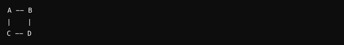
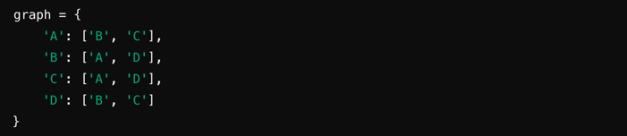
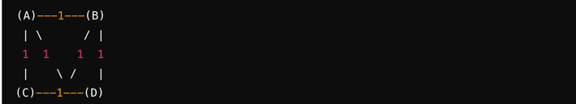
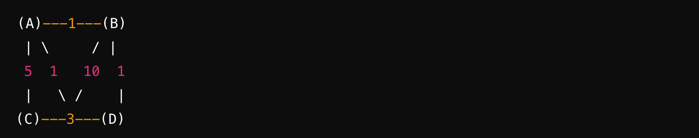
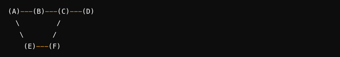

#BFS(너비 우선 탐색) 알고리즘

## 특징

- BFS 알고리즘은 시작 정점으로부터 가까운 정점부터 탐색을 시작하여, 더 이상 방문할 수 있는 정점이 없을 때까지 계속해서 탐색을 진행한다.
    
- 레벨 순서 탐색: 
  - BFS는 같은 레벨에 있는 모든 정점들을 우선적으로 탐색한다. 이는 큐(Queue) 자료구조를 사용하여 구현된다.
      
- 최단 경로 탐색: 
  - 가중치가 없는(unweighted) 그래프에서는 모든 간선의 가중치가 동일할 때 최단 경로를 보장한다. 이는 시작 정점에서 가까운 정점부터 탐색하기 때문에 가능하다.
      
- 큐를 이용한 반복적 구조: 
  - BFS는 큐를 사용하여 반복적으로 구현된다. 시작 정점을 큐에 넣고 시작하여, 큐에서 정점을 꺼내어 인접한 정점들을 방문하고 다시 큐에 넣는다. 이 과정을 큐가 빌 때까지 반복한다.
      
- 넓은 영역 탐색: 
  - 그래프의 깊이가 아닌 너비를 기준으로 탐색하기 때문에, 시작 정점에서 가까운 정점들을 먼저 탐색하고 이후에는 점점 더 멀리 있는 정점들을 탐색한다.

> 간선: 그래프에서 두 정점을 연결하는 선

> 가중치: 각 간선에 부여된 값\
> 이 값은 이동 비용, 거리, 시간 등 다양한 의미를 가질 수 있다. \
> 예를 들어, 지도에서 두 도시를 연결하는 도로의 거리가 가중치가 될 수 있다.

## 동작 정리

1. 시작 정점을 방문하고 큐에 넣는다.
2. 큐에서 정점을 하나 꺼내어 그 정점의 인접한 정점들을 방문한다.
3. 방문하지 않은 각 인접 정점을 큐에 넣는다.
4. 큐가 빌 때까지 위 과정을 반복한다.

위 그래프를 인접 리스트로 표현하면 다음과 같다.

1. 시작 정점 'A'를 방문하고 큐에 넣는다.
   - 방문 순서: A
   - 큐: ['A']
       
2. 큐에서 'A'를 꺼내어 인접한 정점들을 방문한다.
   - 'A'의 인접 정점은 'B'와 'C'이다. 이들을 순서대로 큐에 넣는다.
   - 방문 순서: A -> B, C
   - 큐: ['B', 'C']
       

3. 큐에서 'B'를 꺼내어 인접한 정점들을 방문한다.
   - 'B'의 인접 정점은 'A'와 'D'이다. 'A'는 이미 방문했으므로 'D'만 큐에 넣는다.
   - 방문 순서: A -> B -> D
   - 큐: ['C', 'D']
       
4. 큐에서 'C'를 꺼내어 인접한 정점들을 방문한다.
   - 'C'의 인접 정점은 'A'와 'D'이다. 'A'는 이미 방문했으므로 'D'만 큐에 넣는다.
   - 방문 순서: A -> B -> D -> C
   - 큐: ['D']
       
5. 큐에서 'D'를 꺼내어 인접한 정점들을 방문한다.
   - 'D'의 인접 정점은 'B'와 'C'이다. 이들은 이미 방문했으므로 큐에 추가하지 않는다.
   - 방문 순서: A -> B -> D -> C
   - 큐: []
       
   
6. 큐가 비었으므로 탐색을 종료한다.
   - 따라서 BFS 알고리즘을 사용하여 시작 정점 'A'에서 출발하여 탐색한 결과는 'A' -> 'B' -> 'D' -> 'C'가 된다.

## 장단점
### 장점

1. 최단 경로 탐색에 유리하다.
2. 시작 정점에서 가까운 정점부터 탐색하기 때문에 목표 정점까지의 최단 경로를 보장한다.
3. 구현이 비교적 간단하다.
4. 큐 자료구조를 사용하여 반복적으로 구현할 수 있다.

### 단점

1. 너비 우선 탐색은 경로의 가중치가 모두 동일할 때 적합하다.
2. 가중 그래프에서는 최단 경로를 보장하지 않을 수 있다.
3. 깊이가 매우 깊은 경우 (깊이가 무한히 깊거나 깊은 트리의 경우) 메모리 소모가 크게 될 수 있다.

- 같은 가중치가 모두 1인 그래프에서 BFS를 수행하면 시작 정점으로부터 각 정점까지의 최단 경로를 찾을 수 있다.
- BFS로 A에서 D까지의 최단 경로를 찾으려면, 가중치가 1인 간선을 통해 최단 경로를 찾아야 하지만, 
  BFS는 레벨 순서대로만 탐색하기 때문에 가중치가 10인 간선을 먼저 방문할 수 있다. 
- 따라서 BFS만으로는 최단 경로를 보장할 수 없습니다.

## DFS와의 비교

### 비교 요약

1. 탐색 방식: 
   1. DFS는 깊이를 우선으로 하며, BFS는 너비를 우선으로 한다.
        
2. 구현 방법: 
   1. DFS는 스택 또는 재귀를 사용하여 구현할 수 있고, BFS는 큐를 사용하여 구현한다.
        
3. 적용: 
   1. DFS는 전체 경로 탐색이 필요할 때 유용하며, BFS는 최단 경로를 찾거나 균일한 가중치를 가진 그래프에서 유용하다.
        
4. 메모리 사용: 
   1. BFS는 더 많은 메모리를 사용할 수 있다.
   

- BFS를 시작 정점 A에서 수행할 경우, BFS는 각 레벨별로 인접한 정점들을 탐색한다.
  - 처음에는 A가 큐에 들어가고, 
  - 그 다음에는 A의 인접 정점 B와 E가 큐에 들어간다. 
  - 그 다음 레벨에서는 B와 E의 인접 정점인 C와 F가 큐에 들어가게 된다.   
- 이에 비해 DFS는 스택(Stack) 자료구조를 사용하지만, 스택의 크기는 DFS의 최대 깊이에 따라 결정되기 때문에 일반적으로 BFS보다 메모리를 적게 사용한다.    
- 즉, BFS는 큐를 사용하여 각 레벨의 모든 정점을 메모리에 유지해야 하므로, 그래프의 크기와 너비에 따라 메모리 사용량이 크게 증가할 수 있다.
   

 

