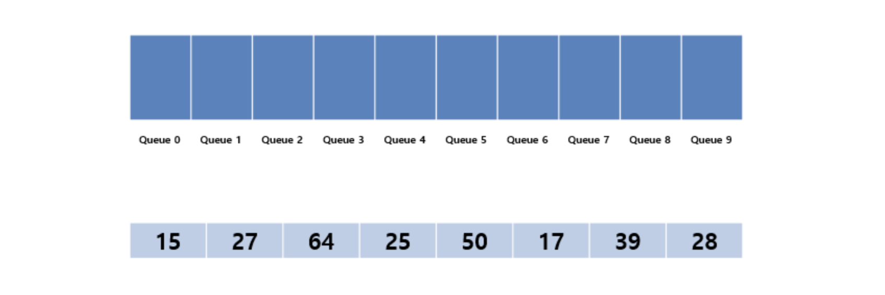
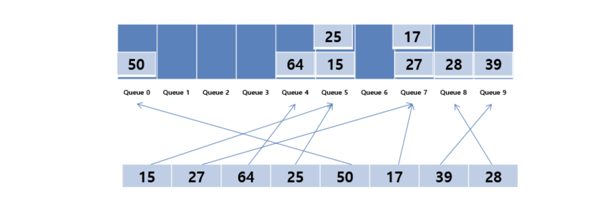
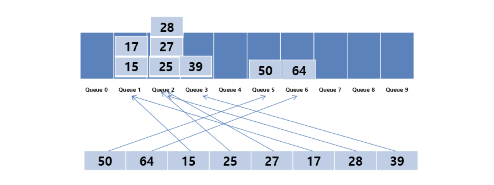

# 기수정렬 (Radix Sort)

## 특징
- 낮은 자리수부터 비교하여 정렬해 간다는 것을 기본 개념으로 하는 정렬 알고리즘이다.
- 하나의 버킷에 둘 이상의 데이터가 들어가는 경우, 들어간 순서대로 꺼내기 위해 큐 자료구조를 사용한다.
- 원소들의 값이 음수가 아닌 정수이고 자릿수가 모두 같을 때 사용 가능하다.
- 기수 정렬은 O(n * k)의 시간 복잡도를 가진다.

## 장점
- 비교 작업을 수행하지 않고 선형 시간 복잡도를 가지므로, 대규모 데이터 세트에 대한 퀵 정렬 및 병합 정렬과 같은 비교 기반 정렬 알고리즘보다 빠르다.
- 계수 정렬에 비해 동작이 느리지만 처리할 수 있는 정수의 크기는 더 크다.
- 동일한 키 값을 가진 요소는 정렬된 출력에서 상대적 순서를 유지하는 안정적인 알고리즘이다.
- 많은 수의 정수나 문자열을 정렬하는 데 효율적이다.
- 요소의 숫자가 작으면 패스 횟수가 작아져, 더욱 효율적으로 사용할 수 있다.
- 자리수가 고정되어 있어 안정성이 보장된다.
- 최악, 최선의 경우가 존재하지 않아 빠르고 안정된 성능을 보여준다.

## 단점
- 부동 소수점 실수처럼 특수한 비교 연산이 필요한 기타 유형의 데이터를 정렬하는 데는 비효율적이다.
- 소규모 데이터 셋이나 고유 키 수가 적은 데이터 셋에서는 효율적이지 않다.
- 길이가 다른 데이터들을 대상으로는 사용하기 어렵다. 
- 길이가 각각 다를 경우 빈 공간을 메꾸는 추가 작업이 발생해 성능이 저하된다.
- 데이터에 따라 데이터 전체 크기에 기수 데이블 만큼의 메모리를 요해 때때로 필요로 한 것보다 더 많은 메모리를 소비한다.

## 정렬 방식

### Least Significant Digit (LSD) 기수 정렬
1. 가장 낮은 자릿수(일의 자리)부터 시작하여 각 숫자를 비교한다.
2. 각 숫자를 해당 자릿수의 값에 따라 버킷(bucket)에 저장한다.
3. 버킷에 저장된 숫자를 순서대로 다시 배열에 복사한다.
4. 다음 자릿수로 넘어가 1- 3단계를 반복한다.
5. 가장 높은 자릿수까지 처리한 후, 정렬이 완료된다.

### Most Significant Digit (MSD) 기수 정렬
1. 가장 높은 자릿수부터 시작하여 각 숫자를 비교한다.
2. 각 숫자를 해당 자릿수의 값에 따라 버킷에 저장한다.
3. 버킷에 저장된 숫자를 순서대로 다시 배열에 복사한다.
4. 다음 자릿수로 넘어가 1-3단계를 반복한다.
5. 가장 낮은 자릿수까지 처리한 후, 정렬이 완료된다.

## 예시

각 숫자에 해당하는 Queue 공간을 먼저 할당한다. (0 ~ 9까지)

먼저 1의 자리 숫자부터 시작한다.\
이 때 데이터 순서대로 각 1의 자리에 해당되는 Queue에 데이터가 들어가게 된다.\
27과 같은 경우는 1의 자리가 7이므로 Queue 7에 들어가고 있다.

1의 자리에 대한 정렬이 완료되면 이와 같은 형태의 배열이 만들어진다.\
그 후 마찬가지로 10의 자리에 대한 정렬을 진행한다.

위의 방법과 마찬가지로 10의 자리에 해당되는 Queue에 데이터를 위치 시키다.\
그 후, 0번 Queue부터 차례대로 다시 데이터를 가지고 온다.

위의 과정을 반복하게 되면 이와 같이 정렬이 완성된다.

