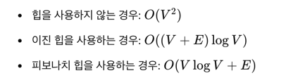
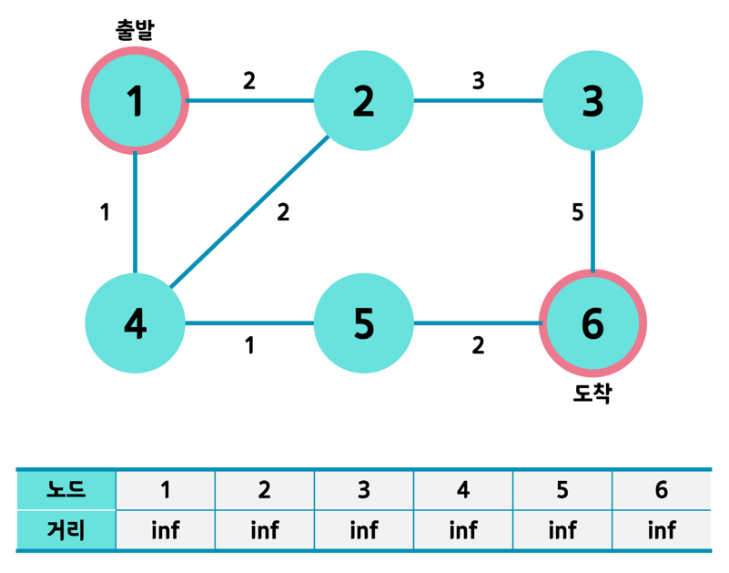
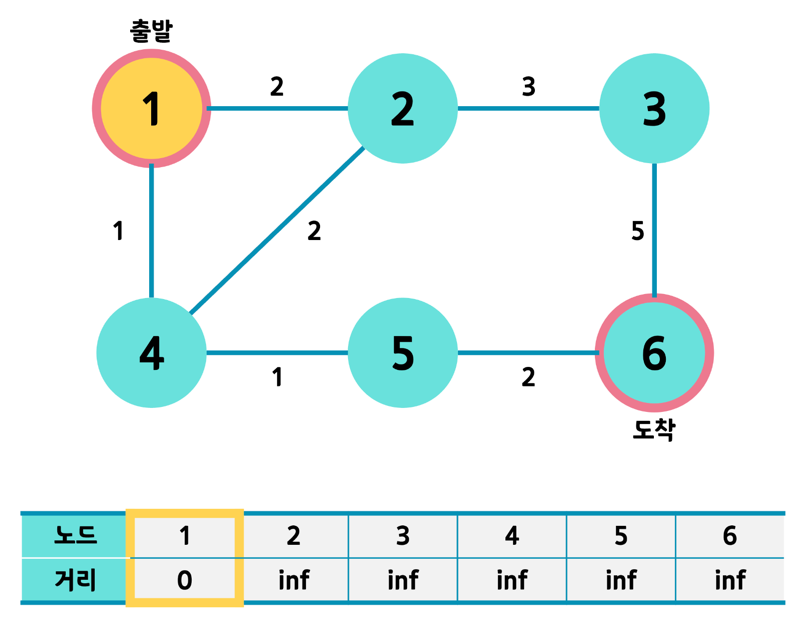
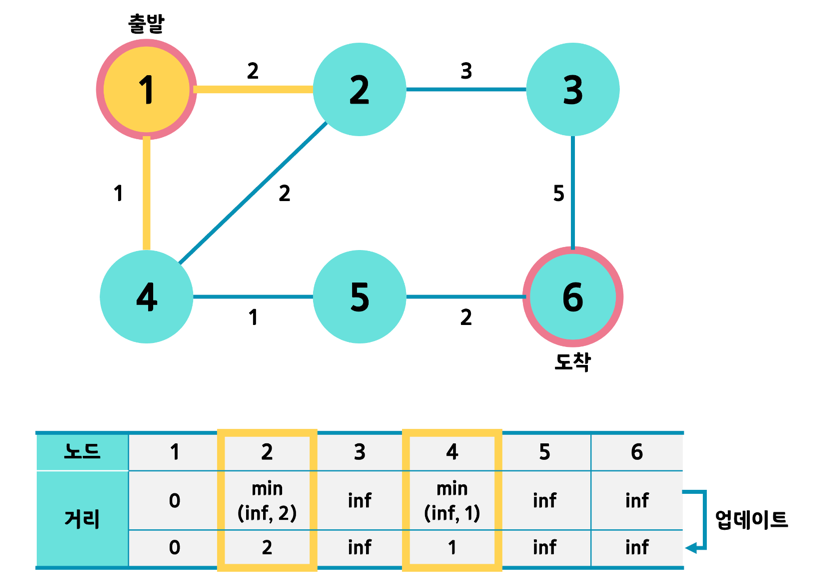
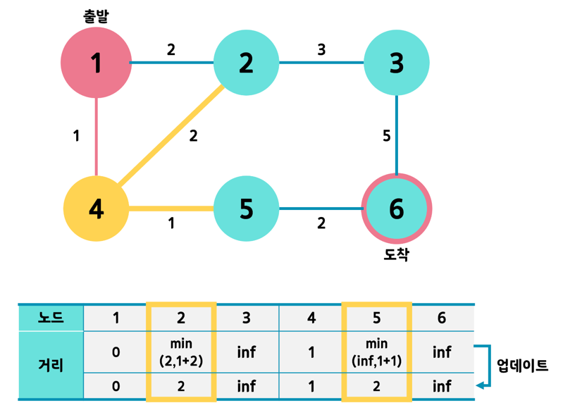
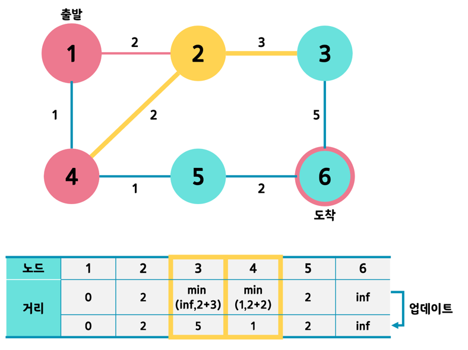
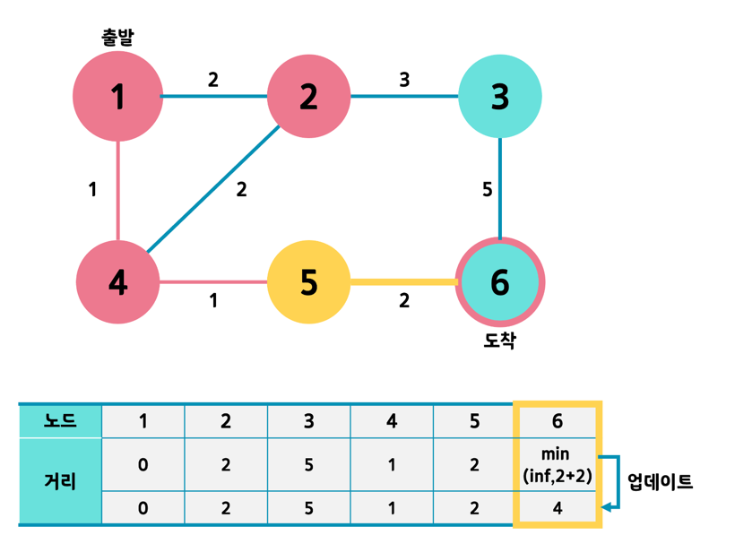
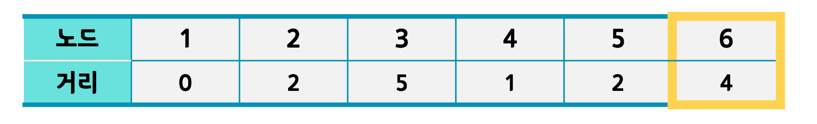
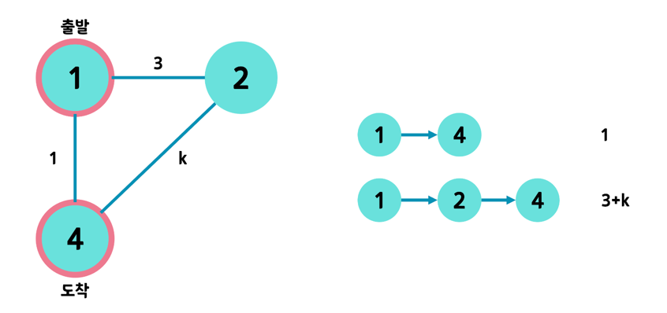

# 다익스트라 (dijkstra)

> 다익스트라 알고리즘(Dijkstra's algorithm)은 그래프에서 단일 출발점으로부터 모든 다른 정점까지의 최단 경로를 찾는 알고리즘으로\
네덜란드의 컴퓨터 과학자 에드스거 다익스트라(Edsger W. Dijkstra)에 의해 1956년에 고안되었다.\
주로 가중치가 있는 방향성 또는 무방향성 그래프에서 사용된다.

## 개요

- 다익스트라(dijkstra) 알고리즘은 그래프에서 한 정점(노드)에서 다른 정점까지의 최단 경로를 구하는 알고리즘 중 하나이다. 
- 이 과정에서 도착 정점 뿐만 아니라 모든 다른 정점까지 최단 경로로 방문하며 각 정점까지의 최단 경로를 모두 찾게 된다. 
- 즉, 매번 최단 경로의 정점을 선택해 탐색을 반복하는 것이다.

## 시간 복잡도

> 여기서 V는 정점의 수, E는 간선의 수를 의미한다.

## 알고리즘 단계 

1. 초기화: 시작 정점을 설정하고, 다른 모든 정점의 거리를 무한대로 설정합니다. 시작 정점의 거리는 0으로 설정한다.
2. 미방문 집합: 모든 정점을 미방문 집합에 추가한다.
3. 최단 거리 정점 선택: 미방문 집합 중에서 최단 거리(가중치)를 가진 정점을 선택한다.
4. 거리 갱신: 해당 정점을 통해 다른 정점으로 가는 경로의 거리를 계산하고, 더 짧은 경로가 발견되면 거리를 갱신한다.
5. 방문 완료 처리: 해당 정점을 방문 완료로 표시하고 미방문 집합에서 제거한다. (기본적으로는 False로 초기화하여 방문하지 않았음을 명시한다.)
6. 반복: 모든 정점을 방문 완료로 처리할 때까지 3-5 단계를 반복한다.

- 출발 노드 1번
- 도착 노드는 6번
- 거리 테이블을 전부 큰 값으로 초기화, 여기서는 inf(무한대)로 초기화했다.

- 출발 노드를 먼저 선택하고 거리를 0으로 한다.

- 1번 노드와 인접한 노드 = 2번, 4번
- 2번과 4번까지의 거리를 계산하여 최소값으로 업데이트한다.
- 2번의 경우 inf와 2 중 작은 값인 2를 택해 할당한다.
- 또한 인접 노드까지의 거리를 모두 업데이트한 1번 노드는 방문 표시를 한다.
- 최근 갱신한 테이블 기준, 방문하지 않는 노드 중 가장 거리값이 작은 번호를 다음 노드로 택한다. 위 상태에서는 4번 노드이다.

- 4번 노드에서 같은 작업을 수행한다.
- 4번과 연결된 2, 5번까지 오는 거리를 계산한다.
- 5의 경우엔 4번까지 오는 데 필요한 거리 + 4 -> 5 간선의 가중치 값인 2와 기존의 값인 inf 중 최솟값을 계산한다.
- 2번 노드의 경우엔 기존값인 2와 4번을 거쳐가는 값인 1 + 2 = 3을 비교한다.
- 이 때 2번 노드는 기존 값이 더 크므로 업데이트하지 않는다. 즉, 1번에서 바로 2번으로 가는 것이 1 -> 4를 거쳐 2번으로 가는 길보다 더 적게 걸린단 뜻이다.
- 다음으로 선택될 노드는 아직 방문하지 않은 노드 2, 3, 5, 6 중 거리값이 가장 작은 노드이므로 2 또는 5이다. 
- 거리 값이 같다면 일단 인덱스가 작은 노드를 택한다. 즉, 2번을 택한다.

- 2번 노드와 연결된 3, 4번 노드에 대해 같은 과정을 반복한다.
- 그 다음 노드는 3, 5, 6번 중 가장 거리값이 작은 5번 노드가 된다.

- 5번 노드와 연결된 6번 노드에 같은 과정을 반복한다.
- 다음 노드를 선택해야 하는데, 아직 방문하지 않은 3번과 6번 중 거리값이 작은 것은 6번이다. 
- 그런데 6번은 더 이어지는 노드가 없으며, 설정한 도착 노드이다. 
- 따라서 알고리즘을 종료한다.

- 최종적으로는 1번에서 6번까지 오는 데 1 - 4 - 5 - 6의 경로를 거치고 최소 거리는 4가 된다.

## 특징

위 동작 예시에서 볼 수 있듯이, 다익스트라 알고리즘은 방문하지 않은 노드 중 최단 거리인 노드를 선택하는 과정을 반복한다.

1. 음수 가중치 처리 불가: 다익스트라 알고리즘은 음의 가중치를 가지는 간선을 처리할 수 없다.

- 위 그림의 상황에서 1 → 4의 경로가 최단경로이려면 3 + k가 1보다 커야 한다. 
- 즉, k > -2가 성립해야 한다. 
- 반대로 k가 -5라고 한다면 오히려 1 → 2 → 4 경로가 더 최단 경로가 된다. 
- 1번에서 연결된 노드 중 4번이 가중치가 적다는 이유로 최단 거리를 1이라 할 수는 없다는 이야기이다.
- 따라서 다익스트라 알고리즘을 사용하기 위해서는 정점 사이를 잇는 간선의 가중치가 양수여야 한다.  

2. 최소 비용 경로: 특정 시작 정점에서 다른 모든 정점까지의 최소 비용 경로를 계산한다.
3. 그리디 알고리즘: 매 단계에서 최단 경로를 확정 지어가며 점진적으로 해결해 나가는 그리디 알고리즘 방식이다.

> 그리디 알고리즘 (욕심쟁이 알고리즘, Greedy Algorithm)\
"매 선택에서 지금 이 순간 당장 최적인 답을 선택하여 적합한 결과를 도출하자" 라는 모토를 가지는 알고리즘 설계 기법으로 최적해를 구하는 데에 사용되는 방법

## 구현 방법
'방문하지 않은 노드'를 다루는 방식에서 <b>'순차 탐색'</b> 을 할 것이나 <b>'우선순위 큐'</b> 를 쓸 것이냐로 나뉜다. 

### 순차 탐색

- <b>'방문하지 않은 노드 중 거리값이 가장 작은 노드'</b> 를 선택해 다음 탐색 노드로 삼는다. 
- 그 노드를 찾는 방식이 순차 탐색이 된다. 
- 즉, 거리 테이블의 앞에서부터 찾아내야 하므로 노드의 개수만큼 순차 탐색을 수행해야 한다.
- 예제는 코드로

### 우선순위 큐

- 순차 탐색을 사용할 경우 노드 개수에 따라 탐색 시간이 매우 오래 걸릴 수 있다. 
- 이를 개선하기 위해 우선순위 큐를 도입하기도 한다.
- 거리 값을 담을 우선순위 큐는 힙으로 구현한다.
- 만약 최소 힙으로 구현한다면 매번 루트 노드가 최소 거리를 가지는 노드가 될 것이다.
- 예제는 코드로

### 순차 탐색과 우선순위 큐 간단 비교

### 순차 탐색
- 장점: 이해하기 쉽고 구현이 간단하다.
- 단점: 모든 정점을 순차적으로 탐색하기 때문에 시간 복잡도가 높다. O(V^)

### 우선순위 큐
- 장점: 시간 복잡도가 낮아 더 효율적이다. O((V + E) log V)
- 단점: 구현이 상대적으로 복잡하다.

> 우선순위 큐를 사용하는 방식이 더 효율적이다.\
특히, 그래프가 큰 경우 시간 복잡도의 차이가 크게 나타나므로 우선순위 큐를 사용하는 다익스트라 알고리즘이 권장된다.
